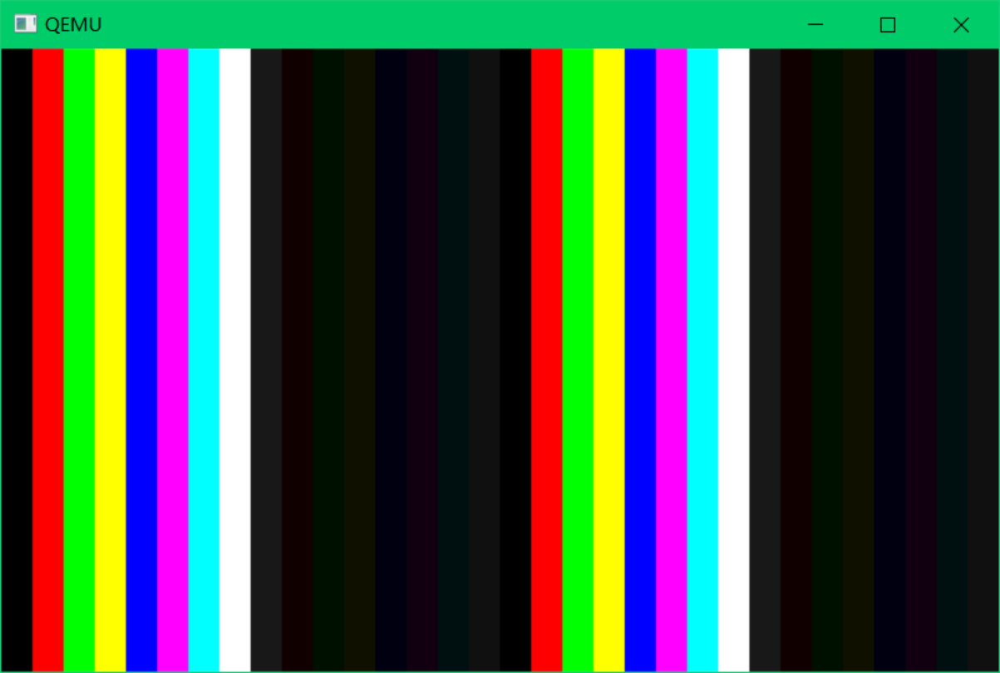

### Day1

写了helloos.img。可以用二进制直接编写，也可以用汇编语言 汇编出来。他写了脚本可以直接在qemu上运行，按照书上的步骤即可。我现在先按照书上面来，等之后再自己用qemu。

todo:扇区引导具体这里还是不明白。

bug:Windows下路径得用\不能/。运行imgtol.com显示16位程序不兼容，但是还是可以跑出来。

### Day2

0x00007c00-0x00007dff ：启动区内容的装载地址

ipl  initial program loader

##### Makefile

命令行所在行开头必须是tab 用空格不行 会报 `Makefile:2: *** missing separator.  Stop.`

todo:至于环境，有点复杂，我们之后再细细研究。我们先把重点放在nas上面。虽然不知道怎么汇编的（就是用他的工具，但是bat里面有的东西不能看懂）。大致就是nas->bin->img。然后就是安装img到虚拟机了。有的用\有的用/真乌鱼子。

### Day3

**读扇区 BIOS中断**

功能02H
功能描述：读扇区
入口参数：AH＝02H
AL＝扇区数
CH＝柱面
CL＝扇区
DH＝磁头
DL＝驱动器，00H~7FH：软盘；80H~0FFH：硬盘
ES:BX＝缓冲区的地址
出口参数：CF＝0——操作成功，AH＝00H，AL＝传输的扇区数，否则，AH＝状态代码，参见功能号01H中的说明

ES:BX 缓冲区位置

CH 柱面

DH 磁头

CL 扇区

AH 2h

AL 读入几个扇区

DL 驱动器 这里用的是0h表示A 也就只有一个驱动器

这里磁盘的结构是 柱面 磁道 扇区

### Day4

如过init的时候不除4

### Day5
为什么下划线 from csdn
 之前见过这种用法，但是不太清楚为什么，就以为是约定俗成，其实也算是约定俗成，这样做的目的是为了防止符号名冲突，因为在一个程序中往往是包含汇编和C文件的，汇编用于启动部分，C文件用于应用程序，最终通过编译器实现编译，对于编译器来说，汇编和C是一视同仁的，那么就会有个问题，如果在汇编和C文件中使用了同一个名字，这是很可能出现的，毕竟汇编相当于机器码也算是稍微高级的语言，在定义子程序或函数时，也是可以用英文拼写的，而C文件中，更会习惯用英文拼写。

所以为了防止类似的符号名冲突，UNIX下的C语言就规定，C语言的源代码文件中的所有全局变量和函数经过编译后，相应的符号名前面会自动的加上下划线“_”。这样做的好处，就是方便是程序开发人员，不用太小心翼翼的起名，避免了与汇编文件中的符号名的冲突。

今天的idt gdt函数没有搞懂